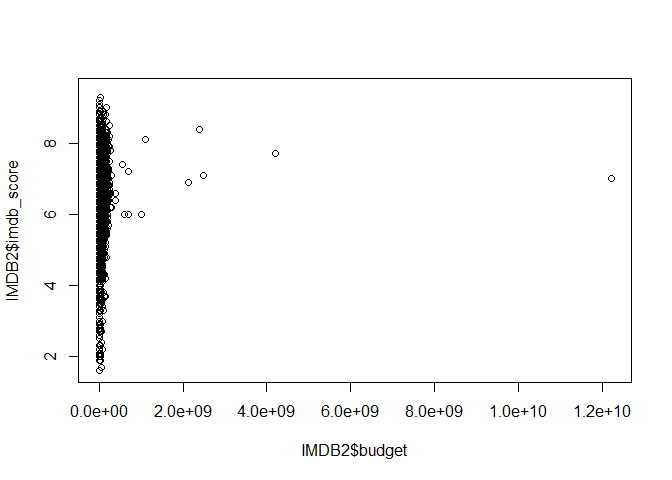
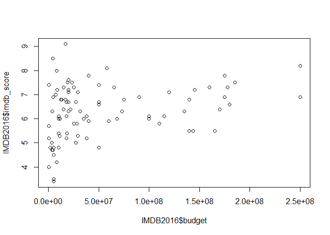
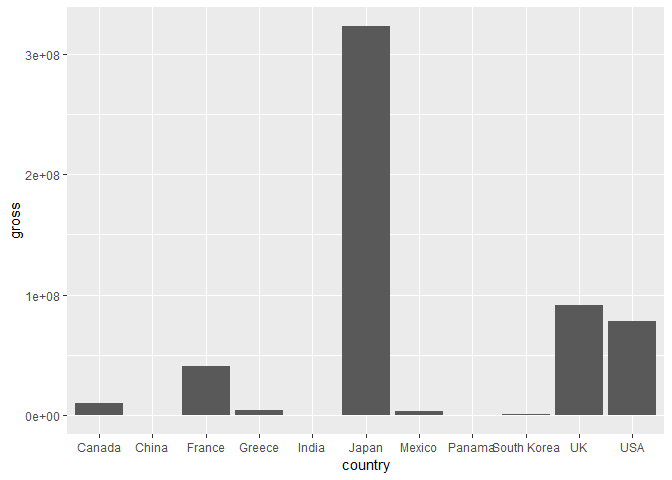

CoderGirl Summer 2019 Cohort: Intro to R
================
Author: Crystal Lewis
Date: 8/14/19

Practice basics
---------------

Basic math

``` r
2+2
```

    ## [1] 4

You can see we get an answer in our console.

Now let's save that information into a variable.

``` r
x<-2+2
```

We can use this variable any time now.

``` r
x+5
```

    ## [1] 9

We can also do Boolean Logic

``` r
x<2
```

    ## [1] FALSE

``` r
x==2
```

    ## [1] FALSE

Comments are made using \#

``` r
#First comment, we must use == rather than = for Boolean Logic. The = sign means the same as <- and will assign to a variable
#Ex: x=2 is the same as x<-2
```

Make a small data frame
-----------------------

A data frame is like a dataset, 2 dimensional data structure, rows and columns. First let's make 3 variables The : provides a sequence of values The c() means to combine values into a vector or list

``` r
#Create 3 variables I want in my data frame
Name<- c("Crystal","Fox", "Oscar")
Age<- c(37,1,15)
Assigned.ID<-(1:3)

#I want to know what type of variable "Name" is
class(Name)
```

    ## [1] "character"

``` r
#Now combine to make the data frame
df<-data.frame(Name, Age, Assigned.ID)

#Let's look at the data frame
df
```

    ##      Name Age Assigned.ID
    ## 1 Crystal  37           1
    ## 2     Fox   1           2
    ## 3   Oscar  15           3

``` r
#What are the variable names in my data frame?
names(df)
```

    ## [1] "Name"        "Age"         "Assigned.ID"

``` r
#What is the structure of my data frame?
str(df)
```

    ## 'data.frame':    3 obs. of  3 variables:
    ##  $ Name       : Factor w/ 3 levels "Crystal","Fox",..: 1 2 3
    ##  $ Age        : num  37 1 15
    ##  $ Assigned.ID: int  1 2 3

``` r
#What are the summary stats of my data frame?
summary(df)
```

    ##       Name        Age         Assigned.ID 
    ##  Crystal:1   Min.   : 1.00   Min.   :1.0  
    ##  Fox    :1   1st Qu.: 8.00   1st Qu.:1.5  
    ##  Oscar  :1   Median :15.00   Median :2.0  
    ##              Mean   :17.67   Mean   :2.0  
    ##              3rd Qu.:26.00   3rd Qu.:2.5  
    ##              Max.   :37.00   Max.   :3.0

You can also make your data frame in one step

``` r
#Create 3 variables I want in my data frame
df2 <- data.frame("Name" = c("Crystal","Fox", "Oscar"), "Age" = c(37,1,15), "Assigned ID" = 1:3)
df2
```

    ##      Name Age Assigned.ID
    ## 1 Crystal  37           1
    ## 2     Fox   1           2
    ## 3   Oscar  15           3

``` r
#Notice the "." between Assigned and ID, R doesn't like spaces between variable names so it adds a .
#Best practice is to create names with no spaces (can use _ or .)
```

Load in data
------------

We don't usually create our dataframes from scratch. We usually collect the data from somewhere else and read it in.

First we need to change our directory to where we saved our IMDB file.

What directory are we in right now?

``` r
getwd()
```

We need to change our working directory. Session-&gt;Set Working Directory-&gt;Choose Directory

We want to load in an excel file but loading in excel files aren't actually native to R (only txt, csv and other basic table files with no formatting). So we need a package to be able to load in an excel file.

Before calling a package, we need to install it. We are going to use the package `readxl`.

``` r
install.packages("readxl")
```

``` r
library(readxl)
```

Now we can read in our IMDB dataset into a data frame called "IMDB".

``` r
IMDB <- read_excel("IMDBMovieMetadata.xlsx")

#We can view the dataset
View(IMDB)

#Note that if I wrote the word view with a lowercase v, the command would not work
#Or if I wrote "imdb" rather than "IMDB" the command would not run
#R is case sensitive
```

``` r
#Get the dimensions of the dataset
dim(IMDB)
```

    ## [1] 5043   28

``` r
#The structure of the dataset
str(IMDB)
```

    ## Classes 'tbl_df', 'tbl' and 'data.frame':    5043 obs. of  28 variables:
    ##  $ color                    : chr  "Color" "Color" "Color" "Color" ...
    ##  $ director_name            : chr  "Tara Subkoff" "Jaume Balagueró" "Jaume Balagueró" "Dan Trachtenberg" ...
    ##  $ num_critic_for_reviews   : num  35 222 252 411 1 133 NA 84 26 68 ...
    ##  $ duration                 : num  101 85 78 104 111 97 22 100 107 85 ...
    ##  $ director_facebook_likes  : num  37 57 57 16 0 19 0 36 53 9 ...
    ##  $ actor_3_facebook_likes   : num  56 6 7 82 247 835 NA 439 463 407 ...
    ##  $ actor_2_name             : chr  "Balthazar Getty" "Pablo Rosso" "Pablo Rosso" "John Gallagher Jr." ...
    ##  $ actor_1_facebook_likes   : num  501 37 120 14000 1000 23000 5 2000 954 861 ...
    ##  $ gross                    : num  NA 27024 NA 71897215 14616 ...
    ##  $ genres                   : chr  "Drama|Horror|Mystery|Thriller" "Horror" "Horror" "Drama|Horror|Mystery|Sci-Fi|Thriller" ...
    ##  $ actor_1_name             : chr  "Timothy Hutton" "Jonathan D. Mellor" "Manuela Velasco" "Bradley Cooper" ...
    ##  $ movie_title              : chr  "#Horror" "[Rec] 2" "[Rec]" "10 Cloverfield Lane" ...
    ##  $ num_voted_users          : num  1547 55597 131462 126893 314 ...
    ##  $ cast_total_facebook_likes: num  1044 73 145 14504 2059 ...
    ##  $ actor_3_name             : chr  "Lydia Hearst" "Andrea Ros" "Carlos Lasarte" "Sumalee Montano" ...
    ##  $ facenumber_in_poster     : num  1 0 0 0 1 6 0 1 5 1 ...
    ##  $ plot_keywords            : chr  "bullying|cyberbullying|girl|internet|throat slitting" "apartment|apartment building|blood sample|crucifix|zombie" "apartment building|character's point of view camera shot|fire station|subjective camera|television reporter" "alien|bunker|car crash|kidnapping|minimal cast" ...
    ##  $ movie_imdb_link          : chr  "http://www.imdb.com/title/tt3526286/?ref_=fn_tt_tt_1" "http://www.imdb.com/title/tt1245112/?ref_=fn_tt_tt_1" "http://www.imdb.com/title/tt1038988/?ref_=fn_tt_tt_1" "http://www.imdb.com/title/tt1179933/?ref_=fn_tt_tt_1" ...
    ##  $ num_user_for_reviews     : num  42 148 374 440 10 549 NA 77 34 133 ...
    ##  $ language                 : chr  "English" "Spanish" "Spanish" "English" ...
    ##  $ country                  : chr  "USA" "Spain" "Spain" "USA" ...
    ##  $ content_rating           : chr  "Not Rated" "R" "R" "PG-13" ...
    ##  $ budget                   : num  1.5e+06 5.6e+06 1.5e+06 1.5e+07 1.2e+07 1.6e+07 NA 8.5e+07 8.0e+06 6.0e+06 ...
    ##  $ title_year               : num  2015 2009 2007 2016 2015 ...
    ##  $ actor_2_facebook_likes   : num  418 9 9 338 445 13000 NA 795 551 618 ...
    ##  $ imdb_score               : num  3.3 6.6 7.5 7.3 7.5 7.2 7.2 4.8 6.4 7.2 ...
    ##  $ aspect_ratio             : num  NA 1.85 1.85 2.35 1.85 1.85 NA 1.85 2.35 1.85 ...
    ##  $ movie_facebook_likes     : num  750 4000 15000 33000 26000 10000 0 372 294 0 ...

``` r
#Look at the first few rows of the dataset
head(IMDB) #First 6 by default
```

    ## # A tibble: 6 x 28
    ##   color director_name num_critic_for_~ duration director_facebo~
    ##   <chr> <chr>                    <dbl>    <dbl>            <dbl>
    ## 1 Color Tara Subkoff                35      101               37
    ## 2 Color Jaume Balagu~              222       85               57
    ## 3 Color Jaume Balagu~              252       78               57
    ## 4 Color Dan Trachten~              411      104               16
    ## 5 Color Timothy Hines                1      111                0
    ## 6 Color Gil Junger                 133       97               19
    ## # ... with 23 more variables: actor_3_facebook_likes <dbl>,
    ## #   actor_2_name <chr>, actor_1_facebook_likes <dbl>, gross <dbl>,
    ## #   genres <chr>, actor_1_name <chr>, movie_title <chr>,
    ## #   num_voted_users <dbl>, cast_total_facebook_likes <dbl>,
    ## #   actor_3_name <chr>, facenumber_in_poster <dbl>, plot_keywords <chr>,
    ## #   movie_imdb_link <chr>, num_user_for_reviews <dbl>, language <chr>,
    ## #   country <chr>, content_rating <chr>, budget <dbl>, title_year <dbl>,
    ## #   actor_2_facebook_likes <dbl>, imdb_score <dbl>, aspect_ratio <dbl>,
    ## #   movie_facebook_likes <dbl>

``` r
#Can set to our own number of rows, can also do tail
head(IMDB, n=3)
```

    ## # A tibble: 3 x 28
    ##   color director_name num_critic_for_~ duration director_facebo~
    ##   <chr> <chr>                    <dbl>    <dbl>            <dbl>
    ## 1 Color Tara Subkoff                35      101               37
    ## 2 Color Jaume Balagu~              222       85               57
    ## 3 Color Jaume Balagu~              252       78               57
    ## # ... with 23 more variables: actor_3_facebook_likes <dbl>,
    ## #   actor_2_name <chr>, actor_1_facebook_likes <dbl>, gross <dbl>,
    ## #   genres <chr>, actor_1_name <chr>, movie_title <chr>,
    ## #   num_voted_users <dbl>, cast_total_facebook_likes <dbl>,
    ## #   actor_3_name <chr>, facenumber_in_poster <dbl>, plot_keywords <chr>,
    ## #   movie_imdb_link <chr>, num_user_for_reviews <dbl>, language <chr>,
    ## #   country <chr>, content_rating <chr>, budget <dbl>, title_year <dbl>,
    ## #   actor_2_facebook_likes <dbl>, imdb_score <dbl>, aspect_ratio <dbl>,
    ## #   movie_facebook_likes <dbl>

Finally let's answer a few questions using our IMDB data
--------------------------------------------------------

### (1) What is the highest gross revenue for a movie in our dataset?

``` r
#What is the variable name for gross revenue?
names(IMDB)
```

    ##  [1] "color"                     "director_name"            
    ##  [3] "num_critic_for_reviews"    "duration"                 
    ##  [5] "director_facebook_likes"   "actor_3_facebook_likes"   
    ##  [7] "actor_2_name"              "actor_1_facebook_likes"   
    ##  [9] "gross"                     "genres"                   
    ## [11] "actor_1_name"              "movie_title"              
    ## [13] "num_voted_users"           "cast_total_facebook_likes"
    ## [15] "actor_3_name"              "facenumber_in_poster"     
    ## [17] "plot_keywords"             "movie_imdb_link"          
    ## [19] "num_user_for_reviews"      "language"                 
    ## [21] "country"                   "content_rating"           
    ## [23] "budget"                    "title_year"               
    ## [25] "actor_2_facebook_likes"    "imdb_score"               
    ## [27] "aspect_ratio"              "movie_facebook_likes"

``` r
#What type of variable is gross revenue
#To access variables in a dataframe you can use the $ notation or [column,row] bracket notation
class(IMDB$gross)
```

    ## [1] "numeric"

``` r
#Get summary statistics
summary(IMDB$gross)
```

    ##      Min.   1st Qu.    Median      Mean   3rd Qu.      Max.      NA's 
    ##       162   5340988  25517500  48468408  62309438 760505847       884

### (2)What movie had the highest gross?

``` r
#I order my data frame by gross descending and then save back over the original IMDB data frame
IMDB<-IMDB[order(-IMDB$gross),]
head(IMDB$movie_title)
```

    ## [1] "Avatar"          "Titanic"         "Jurassic World"  "The Avengers"   
    ## [5] "The Avengers"    "The Dark Knight"

### Duplicates

I notice after answering question 2 that I have duplicates in my dataset. Avengers appears in the dataset twice. So I want to remove duplicates now. I first need to install and load the package `dplyr`.

``` r
install.packages("dplyr")
```

``` r
library(dplyr)
```

``` r
#Let's check again how many cases we have currently
dim(IMDB)
```

    ## [1] 5043   28

``` r
#Get unique/distinct cases only and save into new data frame
IMDB2<-distinct(IMDB)

#Now how many unique cases?
dim(IMDB2)
```

    ## [1] 4998   28

### (3)Is there a relationship between movie budget and IMDB score?

``` r
#Let's create a scatterplot to see
plot(IMDB2$budget, IMDB2$imdb_score)
```



``` r
#There is a crazy outlier here that is skewing our chart, some movie had a budget over 12billion dollars. Could be an error in the data. So let's narrow our data to one year of data (I know that 2016 doesn't have this outlier)

IMDB2016<-subset(IMDB2, title_year==2016)


plot(IMDB2016$budget, IMDB2016$imdb_score)
```



### (4)Which country had the highest average gross revenue for movies in 2016?

We can see this easily through a bar chart. We will need to install the `ggplot2` package to create this.

``` r
install.packages("ggplot2")
```

``` r
library(ggplot2)
```

``` r
#We could save this into an item if we wanted to. Something like graph<-ggplot....
ggplot(data=IMDB2016, aes(x=country,y=gross))+stat_summary(fun.y="mean", geom="bar")
```

 Lesson in deceiving statistics. Japan only had 2 movies in 2016 while the USA had 75 films.

``` r
table(IMDB2016$country)
```

    ## 
    ##      Canada       China      France      Greece       India       Japan 
    ##           3           1           3           1           1           2 
    ##      Mexico      Panama South Korea          UK         USA 
    ##           1           1           2          13          75

``` r
IMDBJapan2016<-subset(IMDB2016, country=="Japan")
#Japan had one film that grossed around 300million and the other has no gross info. So the mean is based off of only one film.
table(IMDBJapan2016$gross)
```

    ## 
    ## 323505540 
    ##         1

``` r
IMDBUSA2016<-subset(IMDB2, country=="USA")
#USA had 75 films ranging from $560k to $400m
ggplot(data=IMDBUSA2016, aes(x=gross))+geom_histogram()
```


